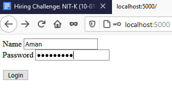
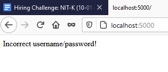
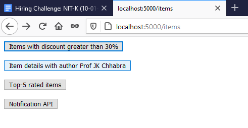
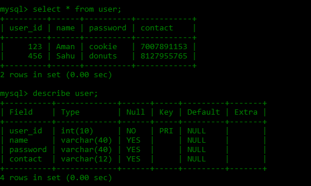
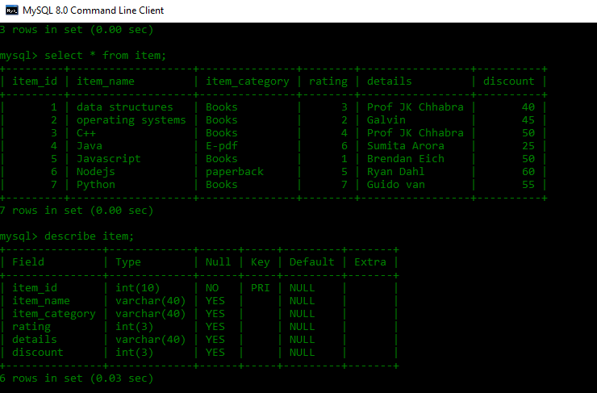
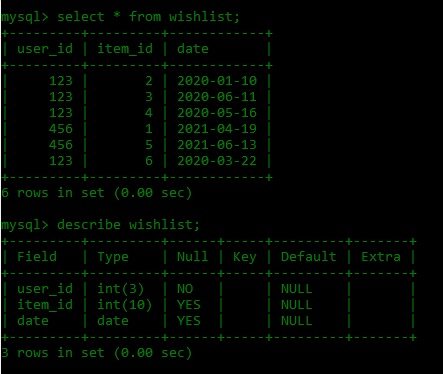
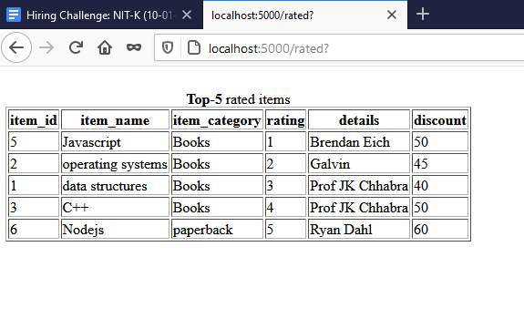
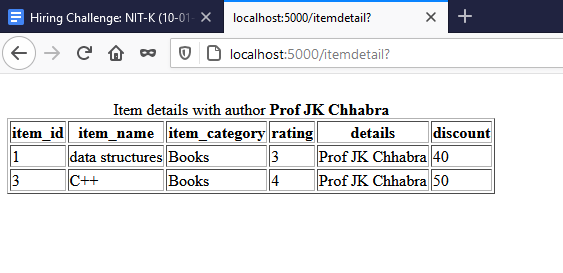
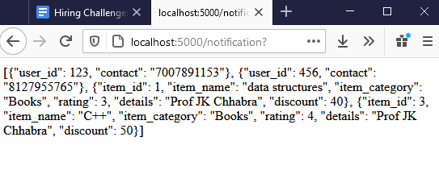

# flask_kaksha
# Login

# Home(With incorrect login credentials)

# Home(With correct login credentials)

# User Schema and Database Data 

# Item Schema and Database Data 

# Wishlist Schema and Database Data 

# API call of discount greater than 30% 

# API call of Top-5 rated items

# API call of item details with author Prof JK Chhabra

# Notificaion API with JSON response

